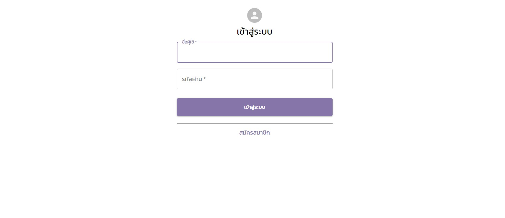
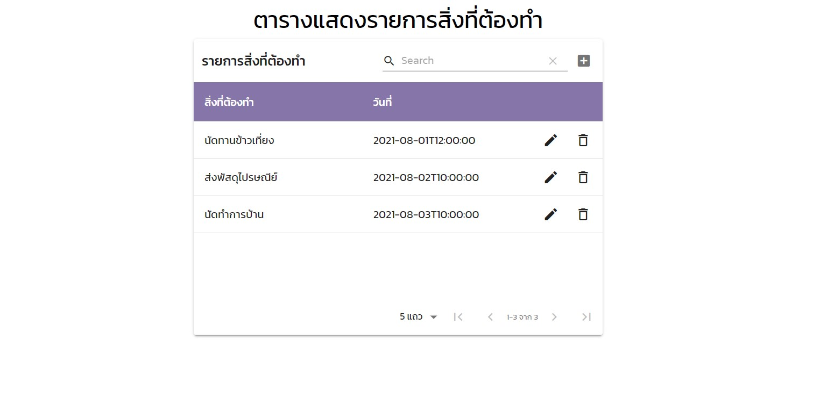

# React To-do list
Todo list web application using React, TypeScript and Material UI. This project has two pages: login page and todo list page which show as following.

## Login Page


## Todo list page


## Technologies


## Installation and Setup
1. create react project with TypeScript template

    ```
    npx create-react-app react-todolist --template typescript
    ```

2. then go inside react-todolist folder

    ```
    cd react-todolist
    ```

3. install axios

    ```
    npm install axios
    ```

4. install material ui

    ```
    npm install @material-ui/core
    ```

5. install react-router-dom

    ```
    npm install --save @types/react-router-dom
    npm install react-router-dom
    ```

6. install material table

    ```
    npm install material-table
    ```

## Start Project
use npm to start React project in port 3000
```
npm run start
```
